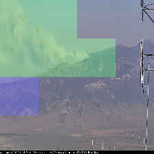

# smoke-detection-net
This project is part of our submission for [ProjectX 2020](https://www.projectx2020.com/),
a 3-month machine learning competition with a focus on climate change.

### Summary of project

In this work we present a multi-label image classifier for a wildfire smoke-detection task. 
Our approach is to divide the image into a KxK grid and predict the cells of the grid containing smoke.
We achieve 3 − 4% improvement over baseline for a 4x4 mesh and empirically establish upper bounds on grid size resolution.
As a secondary contribution, we release the first smoke-annotated video dataset which consists of 139 hours of footage 
from Pan-Tilt-Zoom cameras across 678 videos. 

  

Above are sample predictions with mesh sizes 2x2, 4x4, and 8x8 (TP = green, FP = blue, TN = unshaded). Our pipeline is built on top of [Detectron2](https://github.com/facebookresearch/detectron2). Below are various instructions
for setting up the workspace and running the pipeline.

## Installation
Requires a linux machine with a NVIDIA GPU. Clone this repo and then run:
```
cd scripts && source ./setup_workspace.sh
```
This gives the option to download miniconda (required if not yet installed), sets up a new conda environment, installs the necessary packages.
and generates sample metadata json files for the data loaders. NOTE, restarting the shell might be required
for the conda environment to be activated.

## Dataset
We scraped wildfire footage from the [Nevada Seismological Laboratory](https://www.youtube.com/user/nvseismolab/featured) 
YouTube channel. Raw footage was annotated using the Computer Vision Annotation Tool (CVAT). These bounding box annotations
were then converted to grid labels. The [data_diagram.png](https://raw.githubusercontent.com/Project-X-UBC/smoke-detection-net/main/figures/data_diagram.png)
provides an overview of our data generation pipeline. Raw annotations as well as grid formatted labels are 
available for download [here](https://archive.org/details/smoke_ubc_projectx) (requires a torrent client).

## Running pipeline
Modify parameters in the `set_params()` method inside **main.py** and then run:
```
python main.py
```

Data is generally pulled from the **data/** directory and model outputs are stored inside **output/**.
Make sure to specify a new directory name for each training run by setting the parameter `output_dir` inside **main.py**.

## Notebooks
The notebook **visualize_prediction_results.ipynb** inside **notebooks** is a great tool for visualizing model 
predictions and comparing them to ground truth labels. We have made a [google colab version](https://colab.research.google.com/drive/1Xb7psgLqOoQGZnB2HRXxZEfHOzLu1AhM?usp=sharing)
of this notebook which outputs predictions from 4x4 gridded images fed into a trained model.

## Generating dataset dicts
Detectron2 expects a specific format for the metadata json files. The script **make_real_data_json.py** inside **src/tools** 
takes care of this step. It takes in as an argument the directory containing image data and produces a json file for the 
train, validation, and test set. The sizes of these splits are defined by the global variables `TEST_SIZE` and `VALIDATION_SIZE`
at the top of the script. We use `GroupShuffleSplit` to ensure frames from the same video are within the same 
split. The script **make_real_data_json.py** requires a **frames** directory and **labels.json** file. 
The 'mini' dataset inside **data/mini** shows a sample directory structure for a properly configured dataset. 
```
.
├── frames
│   ├── frame_000000.png
│   ├── frame_000000_b.png 
│   ├── frame_000000_d.png 
│   ├── frame_000000_hc.png 
│   └── frame_000000_lc.png
├── labels.json
├── train.json 
├── val.json 
├── test.json 
``` 

## Modifying grid size
A critical parameter of our approach is the grid size. We have experimented with sizes 1x1 to 10x10. To experiment with 
different sizes, the first step is to generate properly formatted labels similar to the 'mini' dataset. The model expects
the labels to be in a list format e.g. [1, 0, 0, 1] for a 2x2 grid. To modify the final output layer of the network, edit
the value of the `num_classes` parameter inside `set_params()` of **main.py**.

## Google Cloud Platform
We trained all of our models using the GCP compute engine and found some useful resources which we have added below.
#### Jupyter Notebook on a GCP instance
Follow this [blog](https://towardsdatascience.com/running-jupyter-notebook-in-google-cloud-platform-in-15-min-61e16da34d52)
to configure running Jupyter Notebooks on a GCP compute instance. The following is the command to run Jupyter (replace '5000' with the configured port):
```
jupyter notebook --no-browser --port=5000
```

#### TensorBoard
To run TensorBoard during training, `cd` to the root directory of this repo and execute (replace '5000' with configured port):
```
tensorboard --logdir output --port 5000 --bind_all
```

Assumes the Jupyter Notebook steps have been followed, i.e. external static IP, TCP port, etc.
